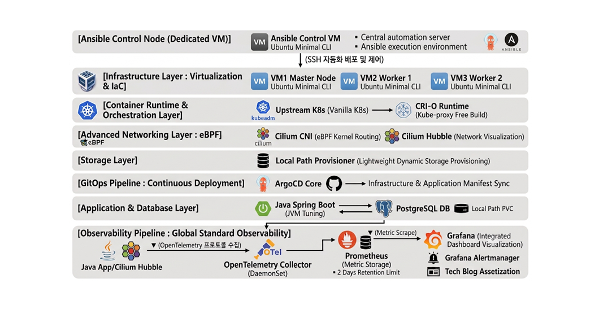

# [Project] Building a Next-Generation Cloud-Native Infrastructure & Observability Platform Based on eBPF (Cilium) and OpenTelemetry

---
## Notice
**This project was driven by my natural curiosity and a strong commitment to continuous upskilling. Please note that certain details or scopes may be subject to modification or adjustment as the project progresses.**

---
### Overview
This is a solo project integrating **Backend, Infrastructure, and DevOps** to demonstrate the **stability and optimization of high-performance cloud infrastructure** within a **highly constrained resource environment of 9GB RAM.**

By converging 
* Infrastructure as Code (IaC)
* modern DevOps observability standards (OpenTelemetry)
* kernel-level networking (eBPF),

this project validates the **architecture, efficiency, and reliability** of an enterprise-grade cloud-native ecosystem under strict resource limitations.

* **Objectives** : _Move beyond traditional monitoring architectures and resource-heavy sidecar proxies to establish **a global-standard OpenTelemetry (OTel) telemetry pipeline**. Leverage kernel-level Cilium CNI to seamlessly observe and control microservice network topologies and metrics within a virtualized environment._
* **Duration** : _4 Weeks_
* **Project Management** : [Jira Dashboard](https://ddolkwakpro.atlassian.net/jira/software/projects/OPWCN/boards/2)
* **Key Features** :
    * **Strict Resource Optimization** : _Custom-tuned an Upstream (Vanilla) Kubernetes cluster to maximize efficiency within a highly constrained 9GB RAM budget, engineered for a 16GB laptop environment where the Host OS natively consumes 6GB._
    * **Lightweight Container Runtime** : _Implemented CRI-O as the dedicated container runtime to minimize daemon overhead and resource footprint._
    * **Declarative Infrastructure** : _Managed the entire ecosystem utilizing GitOps principles to ensure fully automated, auditable, and declarative infrastructure lifecycle management._

---
### System Architecture

---
### Core Technical Stack
* **Infrastructure/IaC** : Ansible, VirtualBox, Ubuntu(CLI-only)
* **Orchestration/Runtime** : Upstream K8s (kubeadm), CRI-O, Local Path Provisioner
* **Networking/eBPF** : Cilium CNI (eBPF), Hubble, Helm
* **GitOps/CD** : ArgoCD Core, GitHub
* **Application/DB** : Java Spring Boot, PostgreSQL
* **Observability** : OpenTelemetry Collector, Prometheus, Grafana

---
### Targets
#### 1. Next-Gen Tech Validation
* **Overcoming Traditional Network Limitations (iptables → eBPF)** : _The standard kube-proxy architecture based on iptables—the default network routing method in Kubernetes—suffers from linear performance degradation as the service scale grows. This project aims to replace it with eBPF (Cilium), which controls packets directly within the Linux kernel space, achieving dramatic performance gains through kernel bypass and optimizing network security._

* **Global Standardization of the Observability Pipeline (Fragmented Agents → OpenTelemetry)** : _This project moves away from traditional, vendor-locked, and resource-heavy monitoring agents attached to individual applications. By unifying telemetry collection and processing through a single hub—the open-source global standard OpenTelemetry Collector—the objective is to reduce architectural complexity and ensure operational flexibility._

#### 2. Resource Optimization ("Infrastructure Diet")
* **Survival Within a Strict 9GB Resource Limit** : _Under the constrained environment where the Host OS natively consumes 6GB, the entire ecosystem—including the Vanilla Kubernetes cluster, observability stack, applications, and the database—must run stably within a strict 9GB RAM budget._

* **Technical Engineering under Constraints** : _To achieve this, aggressive resource-slimming techniques are applied: adopting the lightweight CRI-O runtime (completely eliminating legacy Docker overhead), completely removing kube-proxy, deploying ArgoCD Core, and utilizing a Local Path Provisioner for storage. The goal is to transform physical hardware limitations into a compelling justification for deep technical optimization._

#### 3. Full-Stack Governance
* **100% Declarative Infrastructure & Deployment Automation (IaC & GitOps)** : _Every layer from virtual machine kernel parameter tuning to K8s cluster bootstrapping is automated using Ansible (IaC), while the lifecycle of internal cluster components—such as the CNI, observability stack, and applications—is governed by ArgoCD (GitOps)._

* **Eliminating Manual Intervention** : _The objective is to flawlessly implement a modern infrastructure operating model that completely eliminates manual human intervention from initial provisioning to continuous delivery._

#### 4. Data-Driven Troubleshooting
* **Ensuring Architectural Reliability Through Chaos Engineering** : _Moving beyond merely "building" the infrastructure, the project introduces intentional failures (such as forcefully tearing down a database Pod) during the final stage of development._

* **Proving Resilience with Concrete Data** : _By tracing real-time packet drops via Cilium Hubble and tracking threshold-based alert propagation through Grafana, the ultimate goal is to visibly validate and prove the system's resilience using real-time data metrics._

---
