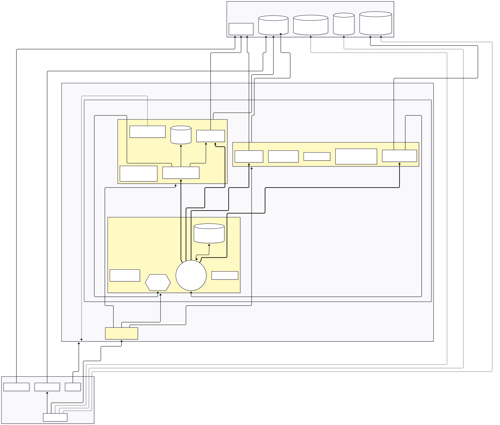
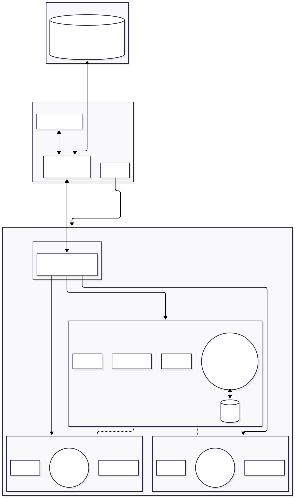
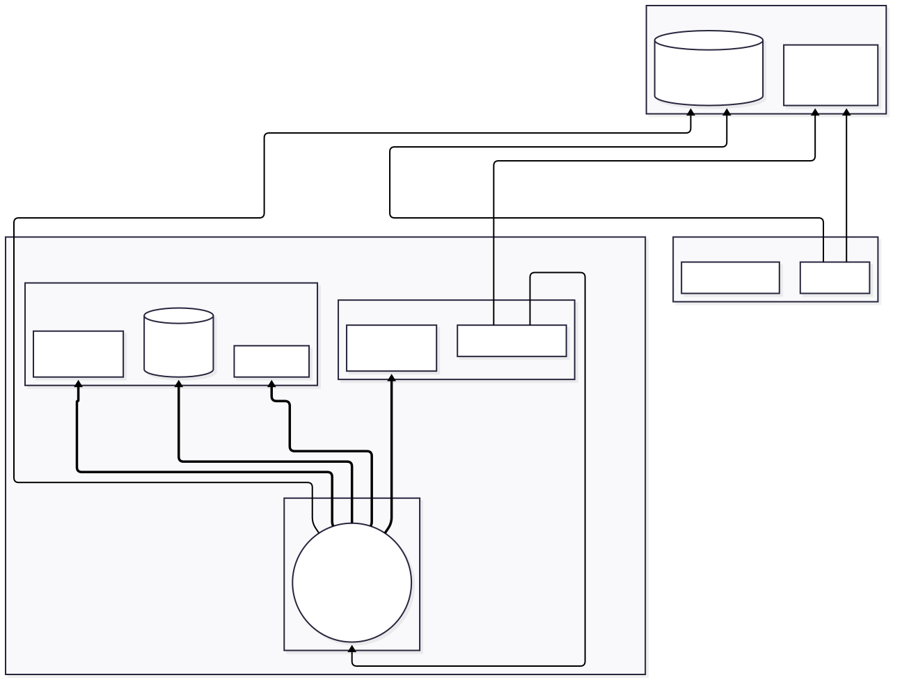
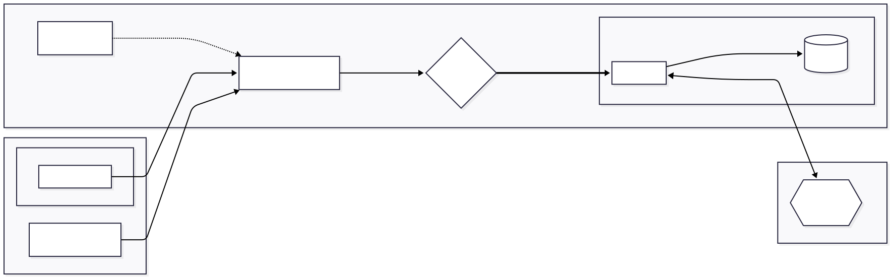
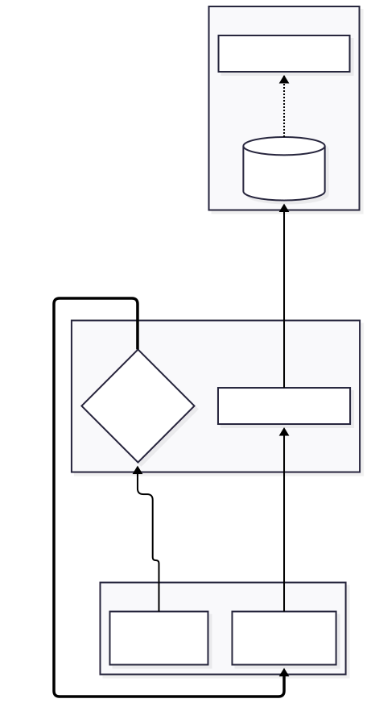

# Next-Generation Cloud-Native Infrastructure & Observability Platform Based on eBPF (Cilium) and OpenTelemetry

### Overview
_This is an Infrastructure as Code (IaC) Repository that automatically provisions a Kubernetes-based cluster in a local development environment(with Resource Constraints of 16GB RAM & 250GB disk) using Vagrant and Ansible._

**Related Repositories** :
* **Cluster Infra Provisioning** : _[observability-platform-with-cloud-native.git](https://github.com/ddolkwak/observability-platform-with-cloud-native)_
* **GitOps Infrastructure & K8s Manifests** : _[observability-platform-cluster-desired-state.git](https://github.com/ddolkwak/observability-platform-cluster-desired-state)_
* **Spring Boot Application Development** : _[observability-spring-boot-app-development.git](https://github.com/ddolkwak/observability-spring-boot-app-development)_

**Additional Links**
* **Project Scheduling & Management** : [Jira Dashboard](https://ddolkwakpro.atlassian.net/jira/software/projects/OPDWCN/boards/3)
* **Investigation & Study** : [Velog.io/@daankwak/posts](https://velog.io/@daankwak/posts)

### Objectives
_By converging_
* Infrastructure as Code (IaC)
* Modern DevOps Observability Standards (OpenTelemetry)
* Kernel-level Networking (eBPF),

_the goal is to build cloud-native architecture and an observability platform within the resource constraints of local host environment._
_1) Move beyond traditional monitoring architectures and resource-intensive sidecar proxy approaches by establishing a global-standard OpenTelemetry (OTel) telemetry pipeline._
_2) Utilize the Cilium CNI with eBPF capabilities to provide kube-proxy-free observability and control over microservice network topologies and metrics._
_3) Applying Strict Resource Optimization, delve into cluster components, connection principles, etc.(Both Kernel-level & application-level)._

---
### System Architecture


### Cluster Provisioning


### GitOps Deployment Pipelines


### Application & Network Routing


### Observability & Monitoring


---
### Core Technical Stack (Overall)
* **Infrastructure/IaC** : _Vagrant, Ansible, VirtualBox, Ubuntu (CLI-only)_
* **Orchestration/Runtime** : _Upstream K8s (kubeadm), CRI-O, NFS Provisioner_
* **Networking/eBPF** : _Cilium(Strict mode), MetalLB, CoreDNS_
* **K8s App Definition/Packaging** : _Helm, Kustomize_
* **GitOps/CD** : _ArgoCD Core, GitHub, GHCR(GitHub Container Registry)_
* **Application/Containerization** : _Java Spring Boot, PostgreSQL, Docker_
* **Observability** : _OpenTelemetry Collector, Micrometer, Grafana Cloud(Mimir)_

---
### Key Features
* **IaC Automation** : _Automated the entire infrastructure provisioning and Kubernetes bootstrapping process from scratch using Vagrant and Ansible, achieving fully reproducible local environments._
* **Strict Resource Optimization** : _Custom-tuned OS Kernel, Upstream Kubernetes cluster, JVM Heap Memory, etc. to maximize efficiency within a highly constrained 9GB RAM._
* **Lightweight Container Runtime** : _Implemented CRI-O as the container runtime, for less resource footprint and fit on Kubernetes API model._
* **Declarative Infrastructure** : _Managed the entire cluster infra utilizing GitOps principles with ArgoCD and Kustomize to ensure fully automated and declarative infrastructure lifecycle management._
* **eBPF-powered Advanced Networking** : _Replaced legacy iptables with Cilium (Kube-proxy-less strict mode) for high-performance eBPF-based direct routing, and MetalLB (L2 mode) for external traffic ingress._
* **Minimal-Agent Observability Pipeline** : _Designed a lightweight monitoring architecture using OpenTelemetry Collector as a DaemonSet. Offloaded the heavy TSDB backend to Grafana Cloud (Mimir) to strictly maintain the local resource budget while ensuring full observability._
  * _TSDB Offload to Grafana Cloud : Original plan was to deploy monitoring stacks(prometheus, grafana) on the cluster, fell through due to local host environment resource constraint._
* **Microservice-Oriented Repository Design** : _Logically divided the project into three distinct repositories (Cluster Infrastructure, GitOps Infra & K8s Manifests, and Application Source Code) to separate concerns and independent deployment lifecycles._

---
### Directory Structure
**1) Cluster Infrastructure Provisioning**
```bash
# GitHub Repository (observability-platform-with-cloud-native.git)
Vagrantfile                               # VM Provisioning
/home/admin/                              # Home Directory
      └── ansible/                        # Ansible Home Directory(Symlinked to /etc/ansible)
          ├── ansible.cfg                 # Ansible Configuration
          ├── collections/                # Prerequisite Ansible Collections
          │   └── requirements.yml
          ├── group_vars/                 # Global Variables Mgmt.
          │   └── all.yml
          ├── hosts                       # Inventory
          ├── roles/                      # Deployment Playbooks Based on Ansible Roles
          │   ├── common/
          │   ├── master/
          │   ├── worker/
          │   ├── argocd-cli/
          │   ├── argocd-core/
          │   ├── helm/
          │   ├── metallb/
          │   └── metrics-server/
          │
          ├── k8s_deploy.yml              # K8s Deployment Playbook
          ├── k8s_startup.yml             # Cluster Init
          ├── k8s_shutdown.yml            # Cluster Graceful Shutdown
          └── argocd_deploy.yml           # ArgoCD Deployment Playbook
```
**2) GitOps Infrastructure & K8s Manifests**
```bash
# GitHub Repository (observability-platform-cluster-desired-state.git)
gitops/
├── bootstrap/
│   ├── gitops-project.yaml    # Project Definition to ArgoCD
│   └── root-app.yaml          # ArgoCD Entrypoint
├── clusters/
│   ├── dev/
│   │   ├── infra-apps.yaml    # infra App-of-Apps
│   │   └── work-apps.yaml     # workloads App-of-Apps
│   └── prod/
│       ├── infra-apps.yaml
│       └── work-apps.yaml
├── apps/                      # ArgoCD Application Definition
│   ├── infra/
│   │   ├── priority-class.yaml
│   │   ├── storage.yaml
│   │   └── otel-collector.yaml
│   └── workloads/
│       ├── postgres.yaml
│       └── spring-app.yaml
└── manifests/                 # Kubernetes Resources
    ├── infra/
    │   ├── priority-class/
    │   │   ├── base/
    │   │   │   ├── kustomization.yaml
    │   │   │   └── priority-classes.yaml
    │   │   └── overlays/
    │   │       ├── dev/
    │   │       └── prod/
    │   └── otel-collector/
    │       ├── base/
    │       │   ├── kustomization.yaml
    │       │   ├── otel-collector-config.yaml
    │       │   ├── otel-collector-daemonset.yaml
    │       │   └── otel-collector-service.yaml
    │       └── overlays/
    │           ├── dev/
    │           └── prod/
    └── workloads/
        ├── postgres/
        │   ├── base/
        │   │   ├── kustomization.yaml
        │   │   ├── deployment.yaml
        │   │   ├── pvc.yaml
        │   │   └── service.yaml
        │   └── overlays/
        │       ├── dev/
        │       └── prod/
        └── spring-app/
            ├── base/
            │   ├── kustomization.yaml
            │   ├── deployment.yaml
            │   └── service.yaml
            └── overlays/
                ├── dev/
                └── prod/
```

---
### How to run
_TBD_